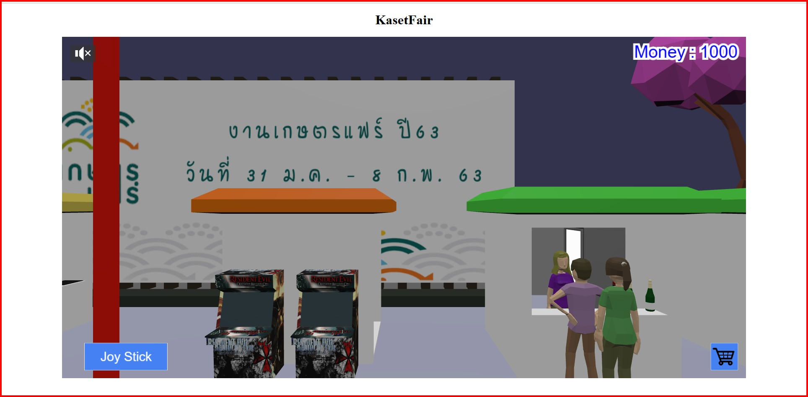

# 65-1-XR-Final-1
## สมาชิกกลุ่ม:<br />
1. ณัฐกฤษฎิ์ พรรณจักร d03n<br />
2. ธนินท์พัชร์ ศรีขันแก้ว KanOmPangg<br />
3. วิศรุต หอมแก่นจันทร์ luckynakabku<br />
4. มาตุพล ชูโชติรส boonblablabla<br />
  
## ฟีทเจอร์:<br />
1. เขียนคอมเมนต์อธิบายโค้ดได้เหมาะสม(ภาษาอังกฤษหรือไทยก็ได้)<br />
2. ร้านขายสินค้าไม่น้อยกว่า 10 ร้าน<br />
3. ผู้ใช้สามารถเดินชมงาน(navigate) และโต้ตอบ(interact) กับร้านค้าได้ในรูปแบบบุคคลที่หนึ่ง(first person view)<br />
4. ผู้ใช้สามารถใช้งานผ่านคอมพิวเตอร์ได้ โดยใช้คีย์บอร์ดและเมาส์<br />
5. มีเมนู GUI หรือ HUD ที่เข้าใจง่ายและใช้งานได้อย่างมีประสิทธิภาพ<br />
6. มีตัวละครประกอบ NPCs(non-player characters) ที่สนทนาโต้ตอบได้<br />
7. สามารถซื้อขายสินค้า มีระบบตระกร้าและการชำระเงิน (เงินสมมุติ) จะทำการซื้อขายผ่านคอมพิวเตอร์ มือถือ หรือ Cardboard VR ก็ได้<br />

## ฟีทเจอร์ที่ไม่สมบูรณ์:<br />
1. ผู้ใช้สามารถเดินชมงานและโต้ตอบได้ในรูปแบบบุคคลที่สาม(third person view) โดยอวตารที่ใช้จะเป็นรูปแบบใดก็ได้(ครึ่งตัว เต็มตัว หรือไม่ใช่มนุษย์)<br />
2. ผู้ใช้สามารถใช้งานผ่านมือถือได้โดยการสัมผัสหน้าจอ<br />
3. ผู้ใช้สามารถใช้งานผ่าน Cardboard VR ได้ โดยใช้การมอง(timed gaze)<br />
## การใช้งานเบื้องต้น:<br />
1. ใช้งานผ่าน computer โดยใช้งานผ่าน local server
2. ใช้งาน Cardboard VR โดยใช้ WebXR API Emulator
### อัปเดต 23/9/65
- สร้าง main branch
- เสนอแนวคิด
- นัดหมายการประชุมครั้งหน้า
### อัปเดต 30/9/65
- สร้าง scene
- ปั้น model
### อัปเดต 7/10/65
- สร้าง 1PP
- ทำ interact ระหว่างสิ่งของ
### อัปเดต 14/10/65
- ปรับปรุง แก้ไขฉาก และ load ไปใช้งานใน scene
- ทำ GUI
- สนทนาโต้ตอบกับ NPCs
- ทำส่วนของ 3PP, virtualJoyStick(ไม่สมบูรณ์)
- เพิ่มส่วนของหน้า loading และ background audio
- ทำให้ใช้ Cardboard VR ได้

## วิธีใช้งานโปรเจค
- 1.ติดตั้ง node.js
- 2.เปิด terminal แล้วใช้คำสั่ง ```npm install``` ในโฟลเดอร์ของโปรเจค
- 3.ใช้คำสั่ง ```npm run serve``` ใน terminal
- 3.terminal จะแสดง local ip ที่สามารถคลิกเพื่อเข้าใช้งานโปรเจคผ่าน web browser ได้

## Screenshot

